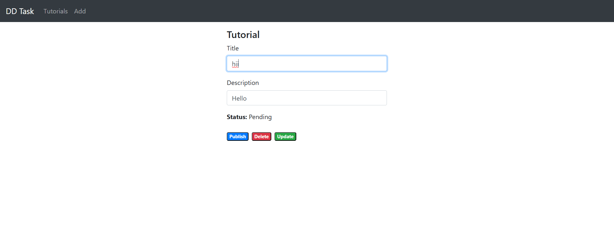
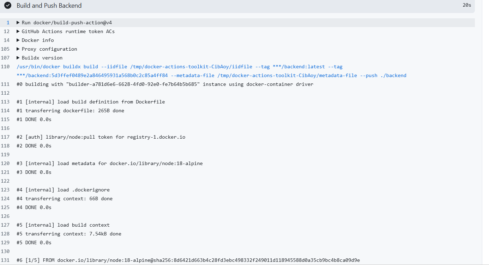
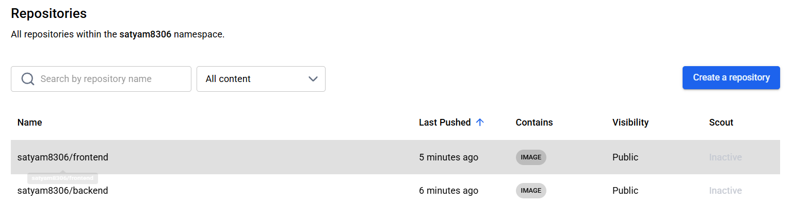
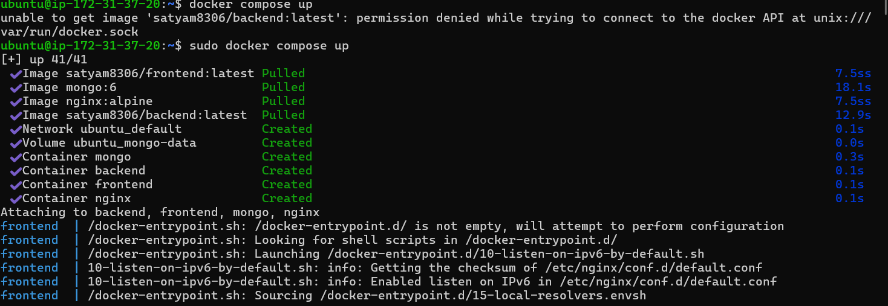
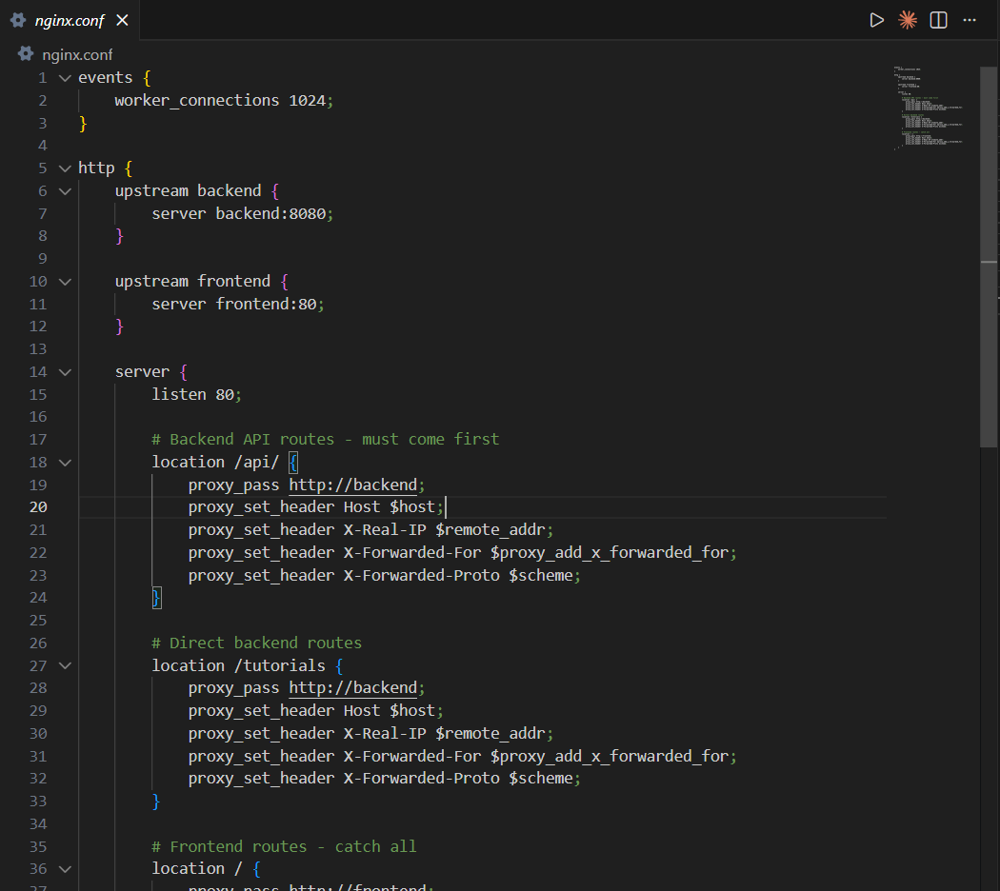
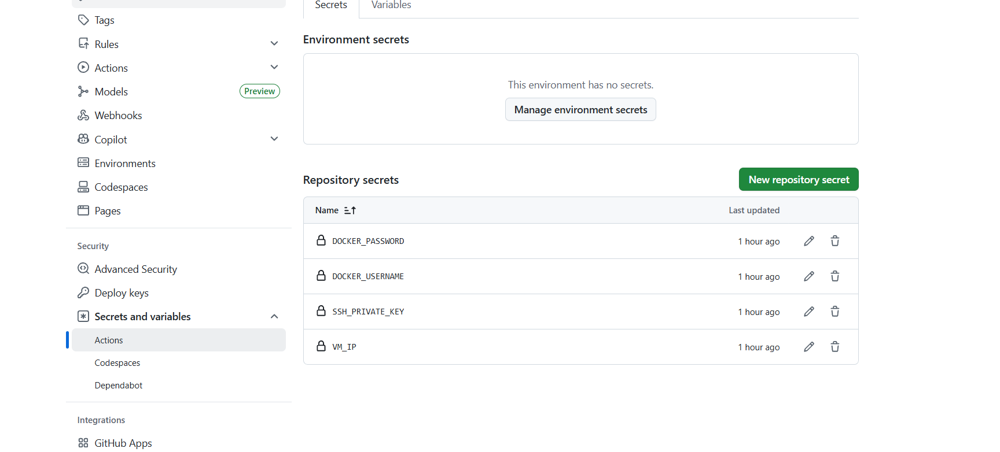
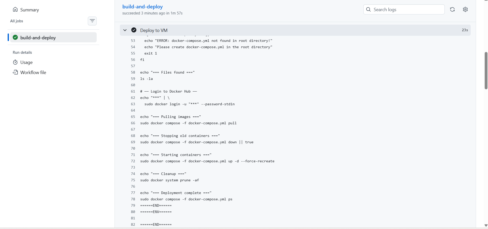

# MEAN Stack CRUD Application with Docker & CI/CD

A full-stack CRUD application using MEAN stack (MongoDB, Express, Angular 15, and Node.js) with complete containerization, CI/CD pipeline, and deployment automation.

## Screenshots

### Application Screenshots


*Main application interface with tutorial list*


*Tutorial creation and editing form*

### CI/CD Pipeline Screenshots


*Docker image build process for backend service*


*Docker Hub repository with built images*


*Running containers on Ubuntu VM*

### Configuration Screenshots


*Nginx reverse proxy configuration*


*GitHub repository secrets configuration*


*Container logs showing successful deployment*

## Architecture

- **Frontend**: Angular 15 application with HTTPClient for API communication
- **Backend**: Node.js with Express providing REST APIs
- **Database**: MongoDB for data persistence
- **Reverse Proxy**: Nginx for routing and load balancing
- **Containerization**: Docker & Docker Compose
- **CI/CD**: GitHub Actions for automated deployment

## Prerequisites

- Docker and Docker Compose installed
- Node.js 18+ (for local development)
- Angular CLI (for local development)
- Docker Hub account
- GitHub repository
- Ubuntu VM (for production deployment)

## Quick Start

### Local Development

1. **Backend Setup**
   ```bash
   cd backend
   npm install
   node server.js
   ```

2. **Frontend Setup**
   ```bash
   cd frontend
   npm install
   ng serve --port 4200
   ```

3. **Access Application**
   - Frontend: http://localhost:4200
   - Backend API: http://localhost:8080

### Docker Development

1. **Build and Run with Docker Compose**
   ```bash
   docker-compose up --build
   ```

2. **Access Application**
   - Frontend: http://localhost:4200
   - Backend API: http://localhost:8080
   - Through Nginx: http://localhost

## Docker Configuration

### Services

- **MongoDB**: Port 27017 with data persistence
- **Backend**: Node.js on port 8080
- **Frontend**: Angular on port 4200
- **Nginx**: Reverse proxy on port 80

### Environment Variables

- **MONGO_URI**: MongoDB connection string
- **DOCKER_USERNAME**: Docker Hub username

## CI/CD Pipeline

### GitHub Actions Workflow

1. **Trigger**: Push to master branch
2. **Build**: Creates Docker images for frontend and backend
3. **Push**: Uploads images to Docker Hub
4. **Deploy**: Pulls images and runs containers on VM

### Required GitHub Secrets

- `DOCKER_USERNAME`: Your Docker Hub username
- `DOCKER_PASSWORD`: Your Docker Hub password/token
- `VM_IP`: Your VM's public IP address
- `SSH_PRIVATE_KEY`: Complete SSH private key

## Production Deployment

### VM Setup

1. **Install Docker**
   ```bash
   curl -fsSL https://get.docker.com -o get-docker.sh
   sudo sh get-docker.sh
   sudo usermod -aG docker ubuntu
   ```

2. **Install Docker Compose**
   ```bash
   sudo curl -L "https://github.com/docker/compose/releases/download/v2.20.0/docker-compose-$(uname -s)-$(uname -m)" -o /usr/local/bin/docker-compose
   sudo chmod +x /usr/local/bin/docker-compose
   ```

3. **Create Application Files**
   ```bash
   mkdir -p /home/ubuntu/mean-app
   cd /home/ubuntu/mean-app
   
   # Create docker-compose.yml
   nano docker-compose.yml
   
   # Create nginx.conf
   nano nginx.conf
   ```

### Security Group Configuration

Required ports:
- **Port 80**: HTTP access (required for users)
- **Port 22**: SSH access (required for deployment)

Optional ports:
- **Port 8080**: Direct backend access
- **Port 4200**: Direct frontend access
- **Port 27017**: MongoDB access (development only)

## Application Access

### Production URLs

- **Main Application**: http://your-vm-public-ip
- **API Direct**: http://your-vm-public-ip/api/tutorials
- **Backend Direct**: http://your-vm-public-ip:8080

### Sharing Options

1. **Direct IP**: http://your-vm-public-ip
2. **Domain Name**: Point DNS A record to VM IP
3. **Cloudflare**: Free SSL/CDN with domain
4. **Ngrok**: Quick testing URL

## API Endpoints

### Tutorials CRUD

- **GET /api/tutorials**: Get all tutorials
- **GET /api/tutorials/:id**: Get tutorial by ID
- **POST /api/tutorials**: Create new tutorial
- **PUT /api/tutorials/:id**: Update tutorial
- **DELETE /api/tutorials/:id**: Delete tutorial

## Troubleshooting

### Common Issues

1. **MongoDB Connection Error**
   - Check MongoDB container status: `docker ps`
   - Verify environment variables in docker-compose.yml
   - Check logs: `docker logs mongo`

2. **Backend Not Responding**
   - Check backend container: `docker logs backend`
   - Verify port conflicts
   - Check MongoDB connectivity

3. **Frontend Not Loading**
   - Check frontend container: `docker logs frontend`
   - Verify build completed successfully
   - Check Nginx configuration

4. **CI/CD Pipeline Failures**
   - Verify GitHub repository secrets
   - Check Docker Hub credentials
   - Validate SSH key access to VM

### Useful Commands

```bash
# View all containers
docker ps

# View container logs
docker logs <container-name>

# Restart services
docker-compose restart

# Stop and remove containers
docker-compose down

# Clean up unused images
docker system prune -f
```

## 📸 Screenshots Documentation

### Required Screenshots for Documentation

1. **CI/CD Configuration**
   - GitHub repository secrets configuration
   - GitHub Actions workflow execution logs
   - Successful pipeline completion

2. **Docker Images**
   - Docker Hub repository showing pushed images
   - Docker build process logs
   - Image tags and versions

3. **Application Deployment**
   - Docker containers running on VM
   - Application accessible via browser
   - CRUD operations working

4. **Infrastructure**
   - Nginx configuration file
   - Docker Compose services
   - VM setup and networking

## 🤝 Contributing

1. Fork the repository
2. Create a feature branch
3. Commit your changes
4. Push to the branch
5. Create a Pull Request

## 📝 License

This project is licensed under the ISC License.

## 📞 Support

For issues and questions:
- Check the troubleshooting section
- Review container logs
- Verify configuration files
- Ensure all prerequisites are met
